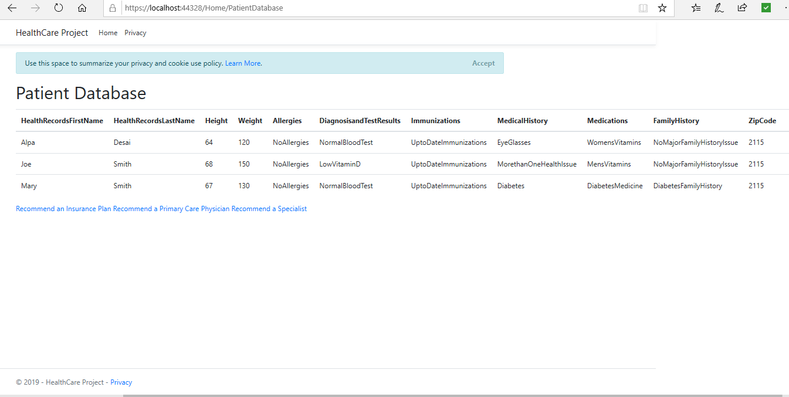
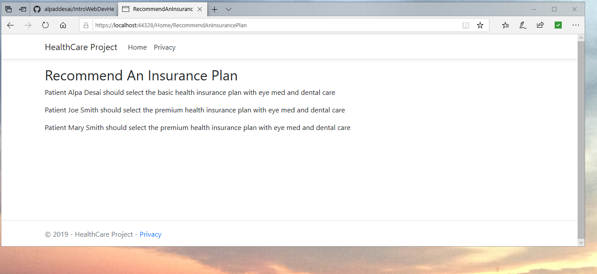
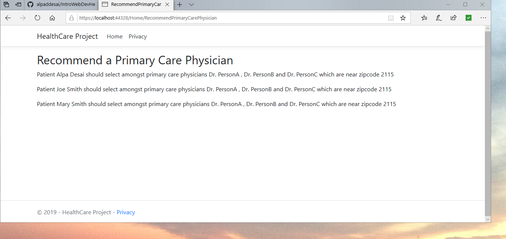
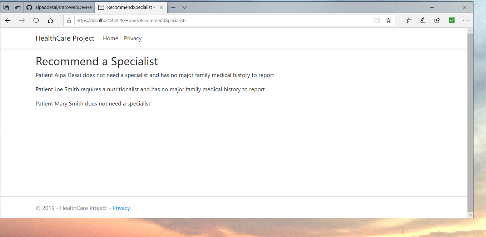

# Introduction to Web Development Project in HealthCare

The project provides an introduction to a web development project in health care. Confidential information is not displayed. All images are custom by Alpa D Desai 

Provide the patient's health record and receive recommendations on health care budget, insurance plan, PCPs and specialists.

Project Overview

The web application is associated with providing non-confidential high level health information into a database search engine. Based on a selected criteria the search engine will recommend an appropriate health insurance plan, a primary care physician and a listing of suitable health care providers/ doctors that specialize in those areas.    

Customer Use Case

•	Seeking a primary care physician and health insurance based on existing health, target customer base is international students and domestic out of state students in the age group of 21 to 25.

•	Primary care physician provides information on a new health issue, you wish to seek a specialist. This search engine can provide the appropriate listings based on zip codes and insurance.  Age group 25+.

•	Relocated a new state and are seeking the appropriate health insurance and primary care physician. Age group 25+.

## Patient Information Form

## Recommend an Insurance Plan

## Recommend a PCP Plan

## Recommend a Specialist

Additional reference : https://github.com/alpaddesai/EngineeringProjectManagement
